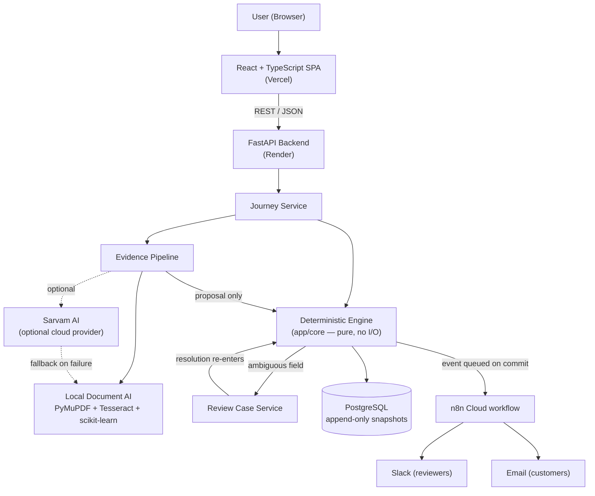

# PaytmFlow

> A deterministic financial-journey recovery platform: guided document/form workflows across six financial products, backed by a local-or-cloud Document AI pipeline, a human review queue, and event-driven notifications.

**Status:** Hackathon/demo prototype, actively deployed.
**Live frontend:** https://paytmflow-frontend.vercel.app
**Live backend health:** https://paytmflow-backend.onrender.com/api/v1/health
**API docs:** https://paytmflow-backend.onrender.com/docs
**License:** Not currently specified in this repository.

---

## Overview

PaytmFlow is a guided workflow engine for financial products — a personal
loan, a health insurance enrollment, periodic KYC re-verification, a
co-branded credit card, a savings account, or a mutual fund investment. A
user picks one of six journeys, and the system tracks exactly which
requirements are still outstanding, explains why each one is blocked,
recommends a single next action, and interprets any document the user
uploads through a real document-intelligence pipeline before deciding
whether that document actually satisfies the requirement.

It solves this by keeping two concerns strictly separate: an AI/OCR layer
that *interprets* evidence (what kind of document is this, what does it
say, how confident is that reading), and a deterministic engine, driven
entirely by per-journey YAML configuration, that *decides* whether a
requirement is satisfied and *writes* the resulting state. The AI layer
never has write access to journey state — it can only produce a proposal
that the deterministic engine independently validates.

When something can't be resolved deterministically — two documents that
disagree on an amount, evidence that's plausible but under the confidence
threshold — the case is routed to a lightweight Human Review Center rather
than guessed at by a model, and outbound events (Slack for reviewers,
email for customers) are dispatched through a real n8n Cloud workflow at
each meaningful lifecycle point.

It's built for two overlapping audiences: an applicant moving through a
financial workflow who needs to know what's missing and why, and a
reviewer who needs a queue of exactly the cases that genuinely require a
human decision — not every case.

## Problem

Financial workflows built around document collection tend to fail users in
the same three ways:

- **It's unclear what's missing.** A rejected or pending application
  rarely explains, in plain language, which specific requirement is
  blocking progress.
- **It's unclear why.** A generic "verification failed" message gives no
  actionable next step.
- **It's unclear what happens after submission.** A document goes into a
  queue with no visibility into whether it was even the right kind of
  document, or whether a conflicting earlier submission is quietly
  overriding it.

The common underlying cause is that document interpretation and workflow
decision-making are usually the same step, often behind an opaque or
fully-manual process, so there's no way to trust a decision or to reproduce
it later.

## Solution

PaytmFlow separates interpretation from decision at the architecture level,
not just as a convention:

1. A document is ingested and validated by content (magic bytes), not by
   its declared name or extension.
2. It's run through a Document AI pipeline — either a from-scratch local
   pipeline (OCR + trained classifier + rule-based extraction) or an
   optional real cloud provider (Sarvam AI) — which produces a
   classification, extracted field values, and a confidence score.
3. That output is handed to a **deterministic engine** as a proposal only.
   The engine — pure, I/O-free, and enforced as such by an import-linter
   contract — evaluates it against the journey's YAML-defined dependency
   graph and confidence thresholds, and is the *only* code path allowed to
   advance journey state.
4. If the engine can't resolve something on its own (a conflict, a
   borderline confidence score), the case goes to a **Human Review
   Center** instead of being decided automatically.
5. Real lifecycle events (evidence uploaded, review needed, case resolved,
   journey completed) are dispatched to an **n8n Cloud** workflow, which
   notifies reviewers on Slack and customers by email — asynchronously,
   and never in a way that can block or fail the request that triggered
   it.

## Key Features

### Six configuration-driven journeys
Lending, Insurance, KYC, Credit Card, Account Opening, and Investment all
share one frontend and one backend engine. Each journey's required fields,
dependency graph, available actions, and evidence mappings live in a YAML
manifest (`backend/app/packs/manifests/`) — there is no
`if journey_type == "LENDING"` branching anywhere in the engine or the UI.

### Deterministic workflow engine
Journey state is a set of typed fields (`SATISFIED`, `BLOCKED`,
`AMBIGUOUS`, ...) connected by an explicit dependency graph. Every mutation
must supply the snapshot version it expects; a stale or conflicting
mutation is rejected outright. Snapshots are immutable and append-only,
enforced by database triggers, not just application code.

### Dual Document AI providers
A local, from-scratch pipeline (PyMuPDF + Tesseract OCR, a TF-IDF/logistic-
regression classifier trained per journey, rule-based field extraction with
OCR-noise correction) runs with no external API. An optional cloud
provider, Sarvam AI, can be swapped in by configuration for Document AI,
speech-to-text, translation, and chat — with automatic, logged fallback to
the local pipeline on any failure.

### Human Review / Exception Resolution Center
Cases the deterministic engine can't resolve on its own are queued,
claimable (with optimistic-lock protection against two reviewers grabbing
the same case), and resolvable — resolution re-enters the *same*
deterministic mutation path a customer's own action would use, never a
separate write path. An optional AI-generated case summary is available as
an advisory aid, always labeled as such.

### Event-driven notifications (n8n Cloud)
Six real lifecycle events — review required, evidence uploaded, customer
action required, journey resolved, escalated, and journey completed — are
dispatched to a production n8n workflow with header-secret auth, an event
allowlist, and `event_id`-based replay/duplicate protection.

### Session-scoped, cookie-based access control
A signed, anonymous session cookie (`itsdangerous`; `HttpOnly`, `Secure`,
`SameSite=Lax`) scopes every journey. Cross-session access to another
session's journey returns `404`, verified directly against the live
deployment.

## How It Works

```text
User
  ↓
React Frontend (Vite, deployed on Vercel)
  ↓  REST / JSON — contract/openapi.yaml
FastAPI Backend (deployed on Render)
  ↓
Journey Service → Deterministic Engine (pure, no I/O)
  ↓                        ↑
Evidence Pipeline ─────────┘  (proposes; never writes state directly)
  ├── Local Document AI (OCR + classifier + extraction)
  └── Sarvam AI (optional cloud provider; falls back to local on failure)
  ↓
Ambiguous? → Human Review Center → same deterministic mutation path
  ↓
PostgreSQL (append-only, trigger-enforced immutable snapshots)
  ↓
n8n Cloud (Slack for reviewers, email for customers) — fired only after commit
```

## Architecture



Only the deterministic engine writes to PostgreSQL. The evidence pipeline
and the review service can only produce proposals or re-enter the engine's
own mutation path — neither has an independent write route to journey
state.

## Technology Stack

| Layer | Technology | Purpose |
|---|---|---|
| Frontend | React 18 + TypeScript, Vite | UI framework, dev server/build |
| Frontend | React Router, TanStack Query, Zustand | Routing, server state, local UI state |
| Frontend | React Hook Form + Zod, Tailwind CSS | Forms/validation, styling |
| Frontend | MSW, Vitest + Testing Library, Playwright | Mock API layer, unit tests, e2e tests |
| Backend | Python 3.12+, FastAPI, Pydantic v2 | Runtime, API framework, schema validation |
| Backend | SQLAlchemy 2 (async), Alembic, PostgreSQL 16 | ORM, migrations, persistence |
| Backend | itsdangerous, uv | Signed session cookies, dependency management |
| AI / Document processing | PyMuPDF, Tesseract (`pytesseract`), Pillow | PDF text extraction, OCR, image preprocessing |
| AI / Document processing | scikit-learn, joblib | Per-journey document classification, model serialization |
| AI / Document processing | Sarvam AI (`api.sarvam.ai`) | Optional cloud Document AI, speech-to-text, translation, chat |
| Integrations | n8n Cloud | Outbound event notifications (Slack + email) |
| Infrastructure | Render, Vercel | Backend + Postgres hosting, frontend hosting + API proxy |
| Quality | pytest, ruff, mypy, import-linter | Backend testing, linting, typing, architecture-boundary enforcement |
| Quality | ESLint, `tsc`, pip-audit / npm audit | Frontend linting/typing, dependency vulnerability scanning |

## Project Structure

```text
paytmflow/
├── frontend/                   React + TypeScript SPA
│   ├── src/screens/             Ten journey-flow screens + Help
│   ├── src/screens/review/      Review Center screens
│   ├── src/components/          Shared UI and primitives
│   ├── src/mocks/                MSW fixtures for offline (mock-mode) development
│   └── tests/                   Unit and end-to-end tests
├── backend/                     FastAPI service
│   ├── app/core/                 Pure deterministic engine (no I/O) — import-linter enforced
│   ├── app/api/                  REST endpoints
│   ├── app/services/             Orchestration layer (journeys, review cases)
│   ├── app/evidence/              Evidence resolution, storage, reconciliation
│   ├── app/docai/                 OCR, classification, extraction, trained models
│   ├── app/ai/                     AIProvider implementations (mock, local_ml, llm, Sarvam) + guardrails
│   ├── app/integrations/           Outbound n8n webhook dispatcher
│   ├── app/security/                Session signing, reviewer-role authorization
│   ├── app/packs/manifests/        Per-journey YAML configuration
│   ├── Dockerfile                  Production image (non-root user)
│   ├── docker-compose.yml          Local Postgres for development
│   └── tests/                      Unit, integration, contract, and safety tests
├── contract/
│   └── openapi.yaml                 Single source of truth for the API surface
└── README.md
```

## Installation

```bash
git clone <repository-url>
cd paytmflow
```

### Prerequisites

| Requirement | Needed for |
|---|---|
| Python 3.12+ | Backend runtime |
| [uv](https://docs.astral.sh/uv/) | Backend dependency/virtualenv management |
| Node.js (recent LTS) + npm | Frontend tooling |
| PostgreSQL 16 (via Docker, recommended) | Persistence |
| Docker | Local Postgres via `backend/docker-compose.yml`, and the production Dockerfile |
| Tesseract OCR on `PATH` | Local Document AI pipeline (`AI_PROVIDER=local_ml`) |
| A Sarvam AI API key (optional) | Only if you set `AI_PROVIDER=sarvam` |
| An n8n Cloud webhook URL + secret (optional) | Only if you set `N8N_ENABLED=true` |

### Environment Variables

Copy `backend/.env.example` to `backend/.env` and `frontend/.env.example`
to `frontend/.env`. **Never commit real secrets.** The full, commented list
lives in the `.example` files; the variables that matter most:

| Variable | Required | Description |
|---|---|---|
| `DATABASE_URL` | Yes | PostgreSQL connection string |
| `APP_ENV` | Yes | `local` \| `ci` \| any other value (e.g. `production`) — see [Security](#security) |
| `SESSION_SECRET` | Yes (outside local/ci) | Signs session cookies; app refuses to start with the placeholder value outside local/ci |
| `DEMO_RESET_SECRET` | Yes (outside local/ci) | Gates the destructive `/demo/reset` endpoint |
| `CORS_ORIGINS` | Yes | Comma-separated list of allowed frontend origins |
| `AI_PROVIDER` | Yes | `mock` \| `llm` \| `local_ml` \| `sarvam` |
| `SARVAM_ENABLED` / `SARVAM_API_KEY` | No | Enables the real Sarvam AI cloud provider |
| `N8N_ENABLED` / `N8N_WEBHOOK_URL` / `N8N_WEBHOOK_SECRET` | No | Enables real outbound event notifications |
| `EVIDENCE_STORAGE_DIR` / `EVIDENCE_MAX_BYTES` | No | Upload storage path and size limit (default 10 MB) |
| `VITE_API_MODE` (frontend) | Yes | `mock` (MSW, no backend needed) \| `live` (real backend) |
| `VITE_API_BASE` (frontend) | Yes | API base path, default `/api/v1` |

Use placeholders like `DATABASE_URL=your_database_url` when sharing your
own configuration — never copy real values from `.env`, logs, or a
deployment dashboard into documentation or version control.

## Running Locally

### Backend

```bash
cd backend
docker compose up -d postgres     # starts PostgreSQL 16
uv sync
uv run alembic upgrade head
uv run uvicorn app.main:app --port 8000 --loop none
```

API: `http://localhost:8000` — interactive docs at `http://localhost:8000/docs`.

### Frontend

```bash
cd frontend
npm install
npm run dev
```

Frontend: `http://localhost:5173`, proxying `/api/v1/*` to the backend.
With the default `VITE_API_MODE=mock`, the frontend runs entirely against
MSW-mocked responses and needs no backend at all.

### Full application

Run both of the above concurrently, then set `VITE_API_MODE=live` in
`frontend/.env` to point the frontend at the real backend and database.

## Usage

1. Open the frontend and choose one of the six financial journeys.
2. Provide the basic goal information the journey asks for.
3. The status screen shows exactly which requirements are outstanding and
   why, and recommends one next action.
4. Upload the requested document (or complete the requested form). The
   Document AI pipeline (local or Sarvam) classifies it, extracts fields,
   and scores its confidence.
5. The deterministic engine decides whether that evidence actually
   satisfies the requirement — a wrong document is rejected outright; a
   correct-but-conflicting or low-confidence one is routed to the Human
   Review Center instead of being silently accepted.
6. Once every mandatory requirement is satisfied, the journey reaches a
   handoff screen — never phrased as an approval or guarantee.
7. A reviewer, in parallel, sees any case that needed a human in a
   dedicated Review Center queue, can claim it, request more information,
   escalate it, or resolve it.

## Try the Demo

You don't need a real bank statement, salary slip, or ID to test the actual
product. The flagship **Personal Loan (LENDING)** journey ships with two
committed **synthetic demo documents** so anyone — a judge, a reviewer, you —
can walk the real evidence pipeline end to end with fictional data:

1. Open the application and select **Personal Loan**.
2. Enter an email (required — this is what lets you actually receive the
   real n8n customer-notification email described below) and the requested
   loan details.
3. On the document upload step, if you don't have a compatible salary slip
   or offer letter, use the **"Testing PaytmFlow?"** panel: click **Use
   Sample** (or **Download instead** and upload it yourself) to feed a
   synthetic salary slip / offer letter straight into the exact same
   upload → OCR → AI classification/extraction → deterministic validation
   pipeline a real document goes through. Nothing about the result is
   faked or hardcoded — see `frontend/public/demo-documents/` and
   `backend/tests/integration/test_demo_documents.py`, which submits these
   same committed files through the real HTTP evidence endpoint and drives
   the journey to `READY`.
4. Continue through the journey to see the deterministic engine's decision
   and, if applicable, the Review Center flow.
5. Watch for the real n8n-driven notification email at the address you
   entered as the journey progresses.

**All provided documents contain synthetic/demo data only — do not upload
real financial or identity documents.** Every generated file carries a
visible "SYNTHETIC DEMO DOCUMENT — NOT A REAL FINANCIAL RECORD" banner.

## API

Full, authoritative surface: `contract/openapi.yaml`; interactive Swagger
UI at `/docs`. Verified from the actual routers in `backend/app/api/v1/`:

| Method | Endpoint | Description |
|---|---|---|
| GET | `/api/v1/health` | Service/DB health check |
| GET | `/api/v1/session` | Resolve or create the caller's session |
| GET | `/api/v1/journey-packs` | List available journey types |
| GET | `/api/v1/journey-packs/{journey_type}` | Journey pack detail |
| GET | `/api/v1/journeys` | List the caller's journeys |
| POST | `/api/v1/journeys` | Create a journey |
| GET | `/api/v1/journeys/{journey_id}` | Journey state |
| GET | `/api/v1/journeys/{journey_id}/recommendation` | Next recommended action |
| GET | `/api/v1/journeys/{journey_id}/diff` | Diff between two snapshot versions |
| GET | `/api/v1/journeys/{journey_id}/review-status` | Whether the journey has an open review case |
| POST | `/api/v1/journeys/{journey_id}/evidence` | Upload/preview evidence (no state transition) |
| POST | `/api/v1/journeys/{journey_id}/actions` | The sole state-mutating endpoint |
| POST | `/api/v1/journeys/{journey_id}/clarifications` | Answer a pending ambiguity |
| POST | `/api/v1/journeys/{journey_id}/chat` | Grounded assistant chat |
| POST | `/api/v1/journeys/{journey_id}/chat/voice` | Voice input (Sarvam speech-to-text) → same chat path |
| POST | `/api/v1/translate` | Translate an explanation/chat string (Sarvam Mayura) |
| POST | `/api/v1/review/role` | Self-switch the caller's session into the reviewer role |
| GET | `/api/v1/review/dashboard` | Reviewer-only case queue summary |
| GET | `/api/v1/review/cases` / `/{case_id}` | Reviewer-only case list / detail |
| POST | `/api/v1/review/cases/{case_id}/claim` | Claim a case |
| POST | `/api/v1/review/cases/{case_id}/resolve` | Resolve a case (re-enters the deterministic engine) |
| POST | `/api/v1/review/cases/{case_id}/request-information` | Ask the customer for more evidence |
| POST | `/api/v1/review/cases/{case_id}/escalate` | Escalate for specialist review |
| GET | `/api/v1/review/cases/{case_id}/customer-view` | Read-only mirror of what the customer sees |
| GET | `/api/v1/review/cases/{case_id}/audit` | Case audit trail |
| POST | `/api/v1/review/cases/{case_id}/ai-summary` | Optional AI-generated case summary |
| POST | `/api/v1/demo/reset` | Destructive demo-data reset (requires `X-Demo-Secret`) |

## Screenshots / Demo

No screenshots or demo media are committed to this repository. The live,
working deployment is the demo — see the links at the top of this
document.

## Testing

| Suite | Command | Result (most recent full run) |
|---|---|---|
| Backend pytest | `cd backend && uv run pytest` | 660/660 passed as of the last full run; 3 new tests added since (`tests/integration/test_demo_documents.py`) independently verified passing, full suite not yet reconfirmed together — see note below |
| Frontend unit tests (Vitest) | `cd frontend && npm run test` | 383/383 passed |
| Ruff (lint + format) | `uv run ruff check . && uv run ruff format --check .` | Clean |
| mypy (whole app) | `uv run mypy app` | Clean except pre-existing, unrelated missing-stub warnings in offline dataset-generation/benchmarking scripts, not part of the deployed application |
| import-linter | `uv run lint-imports` | Clean — deterministic engine boundary intact |
| ESLint + TypeScript | `npm run lint && npm run typecheck` | Clean |
| Frontend production build | `npm run build` | Clean |
| pip-audit (production dependency set) | `uv export --no-dev \| pip-audit -r -` | 0 known vulnerabilities |

A Playwright end-to-end suite also exists under `frontend/tests/e2e/`,
exercising real-browser flows against a live backend; no specific pass
count is quoted here to avoid citing a stale number — run
`npm run test:e2e` for a current result.

The backend's full suite was last run in its entirety without the 3
newly-added demo-document tests. In an environment without a locally
running PostgreSQL instance, targeted verification was run instead: all
359 DB-independent unit tests, plus 72 targeted integration/contract/
safety tests covering every area the demo-document/email change touches
(evidence endpoints, full journey flow, evidence-action integrity, system
endpoints, n8n notifications, and the new demo-document tests
themselves) — all passing. Run `uv run pytest` yourself against a real
PostgreSQL instance for a current full-suite count.

## Security

Documented only where actually implemented and, where noted, verified
directly against the live deployment this session:

- **Signed, anonymous session cookies** (`itsdangerous`; `HttpOnly`,
  `Secure`, `SameSite=Lax`) — no username/password account system.
- **Cross-session isolation, server-enforced**: a request for another
  session's journey returns `404` (not `403`, to avoid confirming
  existence) — *verified live*.
- **`X-Session-Id` header bypass restricted to `local`/`ci`** — any other
  `APP_ENV` ignores it and requires the signed cookie — *verified live*.
- **Stale-snapshot protection**: every mutation must supply the snapshot
  version it expects.
- **Idempotent mutations** via a client-supplied idempotency key.
- **File upload validation**: magic-byte content checks (not
  extension/MIME trust), a 10 MB default size limit, and a stored filename
  derived from a content hash plus an allow-listed extension — never from
  the client-supplied filename, which closes the path-traversal-via-
  filename vector entirely.
- **AI guardrails**: untrusted document text is wrapped in explicit
  boundary tags and length-bounded before reaching any model; an
  AI-selected action is membership-checked against a server-computed
  candidate list (a model cannot invent an action ID); AI output is
  scanned against a banned-word list.
- **n8n webhook authentication**: header-secret auth, an event allowlist,
  and `event_id`-based deduplication — *verified live*: missing/wrong
  secret → `403`, unknown event or missing required field → `400`,
  replayed `event_id` → no duplicate notification.
- **Security response headers** on every API response
  (`X-Content-Type-Options`, `X-Frame-Options`, `Referrer-Policy`,
  `Permissions-Policy`, `Cache-Control: no-store`).
- **Constant-time secret comparison** (`secrets.compare_digest`) for the
  destructive demo-reset endpoint.
- **Non-root container execution** in the production Docker image.
- **Secret/config separation**: no backend secret (Sarvam key, n8n
  secret, session secret, database URL) ever reaches the frontend bundle;
  the app refuses to start with placeholder secrets outside local/CI.

This is not a claim of formal certification, a completed third-party
audit, or production-grade authentication — see
[Limitations](#limitations) for the specific reviewer-identity caveat.

## Deployment

- **Backend**: containerized (`backend/Dockerfile`, non-root user, binds
  to the platform-injected `$PORT`, runs migrations on startup), deployed
  on Render.
- **Frontend**: built with Vite, deployed on Vercel; `frontend/vercel.json`
  proxies `/api/*` to the Render backend so both appear same-origin to the
  browser — the reason the `SameSite=Lax` session cookie works across two
  separate hosting providers with no backend changes.
- **Database**: PostgreSQL, provisioned independently of the local
  `docker-compose.yml` development setup.
- **n8n**: a separately hosted n8n Cloud instance that PaytmFlow only ever
  calls outbound to; it never calls back into PaytmFlow.

This is a hackathon/demo deployment, not a production financial-services
environment.

## Limitations

- **Reviewer identity is a known prototype limitation, not real staff
  authentication.** Any session can self-switch into the reviewer role via
  `POST /review/role`; there is no separate employee/staff account system.
  A real deployment would need an authenticated staff identity and
  role-management system.
- **Anonymous, cookie-based customer sessions** — no customer account
  system, password, or multi-device login.
- **Sarvam and n8n are optional, feature-flagged integrations** — the
  application is fully functional with both disabled, using the
  mock/local providers and no outbound notifications.
- **Tesseract OCR must be available on the host** for the local Document
  AI pipeline; there is no bundled or containerized OCR runtime.
- **No formal assistive-technology certification** — accessibility was
  verified via the browser's accessibility tree and manual keyboard
  testing, not a certified audit with a real screen reader.
- **No CI pipeline is configured in this repository** — the test/lint/
  type commands above are run manually, not automatically on every push.
- **Six journeys' worth of synthetic training/test documents** back the
  local Document AI classifiers (`backend/data/docai/`) — not real
  customer documents.

## Roadmap

**Current (implemented today):**
- All six journeys, the deterministic engine, the local Document AI
  pipeline, the Sarvam AI cloud alternative, the Human Review Center, and
  n8n event notifications, all deployed and verified.

**Future (not implemented, realistic next steps):**
- Real staff authentication for the Review Center, replacing the
  self-switch prototype mechanism.
- A configured CI pipeline running the existing test/lint/type checks on
  every push.
- Certified assistive-technology testing with a real screen reader.
- Expanding the Sarvam Document AI integration's training/evaluation
  coverage to match the local pipeline's per-journey classifiers.

## Contributing

1. Create a focused branch for your change.
2. Keep changes scoped — avoid mixing unrelated fixes or refactors.
3. Add or update tests covering the change.
4. Run the checks before opening a pull request:
   ```bash
   # Backend
   cd backend && uv run pytest && uv run ruff check . && uv run ruff format --check . && uv run mypy --strict app/core && uv run lint-imports

   # Frontend
   cd frontend && npm run typecheck && npm run lint && npm run test && npm run build
   ```
5. Open a pull request describing the change and its motivation.

## License

Not currently specified in this repository.

## Acknowledgements

- [Sarvam AI](https://docs.sarvam.ai) — optional cloud Document AI,
  speech-to-text, translation, and chat provider.
- [n8n](https://n8n.io) — outbound event notification workflow engine.
- PyMuPDF, Tesseract OCR, and scikit-learn — the local Document AI
  pipeline.
- FastAPI, SQLAlchemy, React, Vite, and the rest of the open-source
  libraries listed in `backend/pyproject.toml` and `frontend/package.json`.
